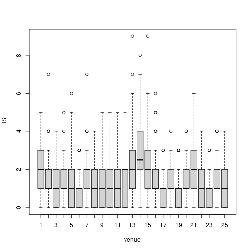
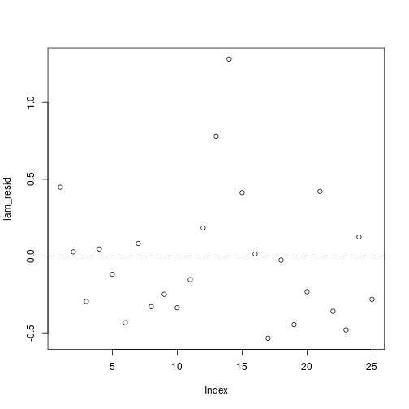
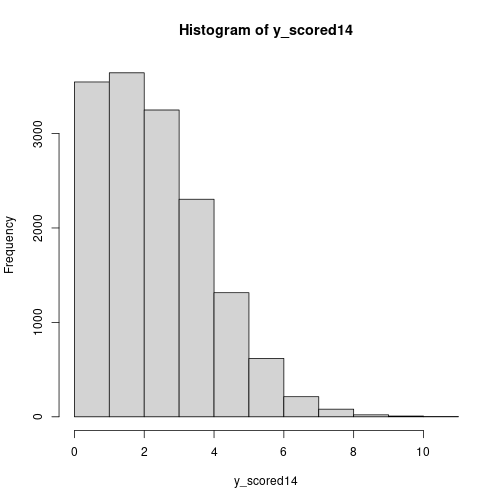

## Executive summary

The English Premier League consists of 380 matches, spanning 38 week games for each team over the course of a full year. This project delves into the exploration of enhancing this limited array of recurring events through MCMC simulation. Starting with an initial dataset of 1500 matches, we employ hierarchical modeling with a Poisson distribution to forecast Over/Under outcomes at home. Additionally, a Poisson regressor is applied to predict home team goal scoring, factoring in variables like the opposing team and week game. Empirical fan insights validate the credibility of the outcomes across various scenarios when tested.

## Introduction
This project seeks to replicate the scoring of goals by both the home and away teams within a specific venue. By employing Markov Chain Monte Carlo (MCMC), it becomes feasible to enhance a collection of recurring events, akin to those observed in soccer matches. This concept draws inspiration from the example presented in the Hierarchical Modeling lesson, which illustrated the estimation of the number of chocolate chips in a cookie based on its location.

The primary aim is to quantify the goals scored and conceded by the home team within a singular venue. This data will subsequently be employed to calculate the over/under of the match.

## Data
The dataset contains 1539 match scores from English Premier League covering from the 2019/20 season to the first week of the 23/24 season. The data was retrieved using API-Football.

```{r, echo=FALSE}
# Read file containing scores
dat = read.csv(file="premier_basic_info.csv", header=TRUE)
head(dat)
# Encoding home team name
dat$venue <- as.numeric(as.factor(dat$HT))
dat$opposite <- as.numeric(as.factor(dat$AT))
# Number of matches per venue
table(dat$venue)
```

```
##        id  Sea Lge Date                HT                AT HS AS GD WDL
## 1 1035039 2023  GB    1       Bournemouth          West Ham  1  1  0   D
## 2 1035040 2023  GB    1          Brighton             Luton  4  1  3   W
## 3 1035043 2023  GB    1         Newcastle       Aston Villa  5  1  4   W
## 4 1035046 2023  GB    1 Manchester United            Wolves  1  0  1   W
## 5 1035038 2023  GB    1           Arsenal Nottingham Forest  2  1  1   W
## 6 1035041 2023  GB    1           Everton            Fulham  0  1 -1   L
```

Here we can see that the amount of matches per venue varies upon relegation
```{r, echo=FALSE}
#  1  2  3  4  5  6  7  8  9 10 11 12 13 14 15 16 17 18 19 20 21 22 23 24 25 
# 77 76 39 39 77 58 77 76 77 38 57 76 76 76 77 77 38 19 39 76 76 38 19 76 76
```

And here we remember that soccer is a low score game, so we expect goals at home to be between 1 and 2 ~ 1.505.

```r
hist(dat$HS)
```


If we plot each of the goals scored at the home stadium, it is possible to notice some teams above the average, for example team 14 corresponding to Manchester City.

```r
boxplot(HS ~ venue, data=dat)
```



## Model
As mentioned earlier, this project draws inspiration from the UC Santa Cruz Course on Bayesian Statistics: Techniques and Models. Therefore, I will provide a brief summary of what I have learned to substantiate the chosen distributions. Goals scored will be drawn from a Poisson distribution tailored for discrete integers. The λ parameter for the Poisson distribution will be contingent on the average goals scored within a specific venue. This average will be derived from a gamma prior with hyperparameters α and β, which control the variance of goals scored across different venues.

```{r, echo=FALSE}
library("rjags")

# Model for Goals Scored

mod_string = " model {
for (i in 1:length(HS)) {
  HS[i] ~ dpois(lam[venue[i]])
}

for (j in 1:max(venue)) {
  lam[j] ~ dgamma(alpha, beta)
}

alpha = mu^2 / sig^2
beta = mu / sig^2

mu ~ dgamma(2.0, 1.0/5.0)
sig ~ dexp(1.0)

} "

set.seed(113)

data_jags = as.list(dat)

params = c("lam", "mu", "sig")

mod = jags.model(textConnection(mod_string), data=data_jags, n.chains=3)
update(mod, 1e3)

mod_sim = coda.samples(model=mod,
                       variable.names=params,
                       n.iter=5e3)
mod_csim = as.mcmc(do.call(rbind, mod_sim))

# Model for Goals Conceded

mod_string_gc = " model {
for (i in 1:length(AS)) {
  AS[i] ~ dpois(lam[venue[i]])
}

for (j in 1:max(venue)) {
  lam[j] ~ dgamma(alpha, beta)
}

alpha = mu^2 / sig^2
beta = mu / sig^2

mu ~ dgamma(2.0, 1.0/5.0)
sig ~ dexp(1.0)

} "

mod_gc = jags.model(textConnection(mod_string_gc), data=data_jags, n.chains=3)
update(mod_gc, 1e3)

mod_sim_gc = coda.samples(model=mod_gc,
                       variable.names=params,
                       n.iter=5e3)
mod_csim_gc = as.mcmc(do.call(rbind, mod_sim_gc))

## convergence diagnostics
# plot(mod_sim)
```

After a 5000 burn-in period and three chains of 1000 iterations we retrieved the following posterior means.

```{r, echo=FALSE}
(pm_params = colMeans(mod_csim))
```

```{r, echo=FALSE}
#   lam[1]    lam[2]    lam[3]    lam[4]    lam[5]    lam[6]    lam[7]    lam[8]    lam[9]   lam[10]
#1.9033734 1.4823302 1.1595199 1.5037008 1.3348981 1.0225891 1.5377455 1.1230324 1.2058319 1.1182034 
#  lam[11]   lam[12]   lam[13]   lam[14]   lam[15]   lam[16]   lam[17]   lam[18]   lam[19]   lam[20]
#1.3017258 1.6405092 2.2366669 2.7386970 1.8672407 1.4672063 0.9197353 1.4294883 1.0070710 1.2201855 
#  lam[21]   lam[22]   lam[23]   lam[24]   lam[25]        mu       sig 
#1.8815338 1.0971932 0.9742766 1.5768664 1.1716127 1.4555156 0.4554496
```

Here are the observation level residuals

```r
yhat = rep(pm_params[1:25], each=77)
resid = dat$HS - yhat
```

```r
plot(jitter(yhat), resid)
```


And here the venue level residuals

```r
lam_resid = pm_params[1:25] - pm_params["mu"]
plot(lam_resid)
abline(h=0, lty=2)
```


Here, a pronounced positive pattern is evident in the residuals within the middle range.

### Model two
By employing a Hierarchical Poisson Regression Model, we can assign significance to additional factors, such as the opposing team and the specific date/week within the ongoing season when the match is scheduled. Accounting for the opposing team will be drawn from a gamma distribution as well.

```{r}
# Model for Goals Scored using
# Hierarchical Poisson Regression

library("rjags")

mod_string_pr = " model {

for (i in 1:length(HS)) {
  HS[i] ~ dpois(lam[i])
  log(lam[i]) = v[venue[i]] + b_date*Date[i] + b_against[opposite[i]]
}

#non-informative prior
b_date ~ dnorm(0.0, 1.0/1e4)
for (j in 1:max(venue)) {
  v[j] ~ dgamma(alpha, beta)
}
for (j in 1:max(opposite)) {
  b_against[j] ~ dgamma(alpha, beta)
}

alpha = mu^2 / sig^2
beta = mu / sig^2

mu ~ dgamma(2.0, 1.0/5.0)
sig ~ dexp(1.0)

} "

set.seed(113)

data_jags = as.list(dat)

params = c("mu", "sig", "v", "b_against", "b_date")

mod_pr = jags.model(textConnection(mod_string_pr), data=data_jags, n.chains=3)
update(mod_pr, 1e3)

mod_sim_pr = coda.samples(model=mod_pr,
                       variable.names=params,
                       n.iter=5e3)
mod_csim_pr = as.mcmc(do.call(rbind, mod_sim_pr))
```

This way we can predict the goals scored by the home team for a specific match.

## Results

As previously mentioned, the objective is to forecast the Over/Under outcome of the match for the home team. Our dataset comprises information up to the first week of the ongoing EPL season 23/24. Presently, we possess the capability to simulate both goal scoring and goal conceding for each venue, as we remember Manchester City its the venue 14.

As an example predicting goals scored

```r
(n_sim = nrow(mod_csim))
```

```
## [1] 15000
```

```r
y_scored14 = rpois(n=n_sim, lambda=mod_csim[,"lam[14]"])
hist(y_scored14)
```



As an example predicting goals conceded

```r
y_conced14 = rpois(n=n_sim, lambda=mod_csim_gc[,"lam[14]"])
hist(y_conced14)
```

The probability of City conceding more than 2 goals is really low

```r
mean(y_conced14 > 2)
```

```
## [1] 0.0642
```

Meanwhile the probability of scoring more than 2 goals

```r
mean(y_scored14 > 2)
```

```
## [1] 0.5207333
```

Therefore, we can conclude that when playing against Manchester City at home, we will expect an outcome of over two goals in favor of Manchester City.

### Results two

In week 2 Manchester City played against New Castle (against code: 17).

```r
x1 = c(1, 2, 1) # Manchester City playing against New Castle in Week 2
#compute the linear part of the predictor:
loglam1 = mod_csim_pr[,c(17, 27, 47)] %*% x1
#apply the inverse link: get lambda:
lam1 = exp(loglam1)
# use these samples for the lambda for each individual and simulate y using the likelihood:
n_sim = length(lam1)
y1 = rpois(n=n_sim, lambda=lam1)
mean(y1)
```

```
## [1] 1.381733
```
This prediction suggests that Manchester City is expected to score an average of 1.4 goals against New Castle. However, if we hypothetically test this against a formidable team like Liverpool (encoded as 13), the projected goal average slightly decreases to around 1.22 goals.

```r
x1 = c(1, 2, 1) # Manchester City playing against Liverpool in Week 2
#compute the linear part of the predictor:
loglam2 = mod_csim_pr[,c(13, 27, 47)] %*% x1
#apply the inverse link: get lambda:
lam2 = exp(loglam2)
# use these samples for the lambda for each individual and simulate y using the likelihood:
n_sim = length(lam2)
y2 = rpois(n=n_sim, lambda=lam2)
mean(y2)
```

```
## [1] 1.230067
```
